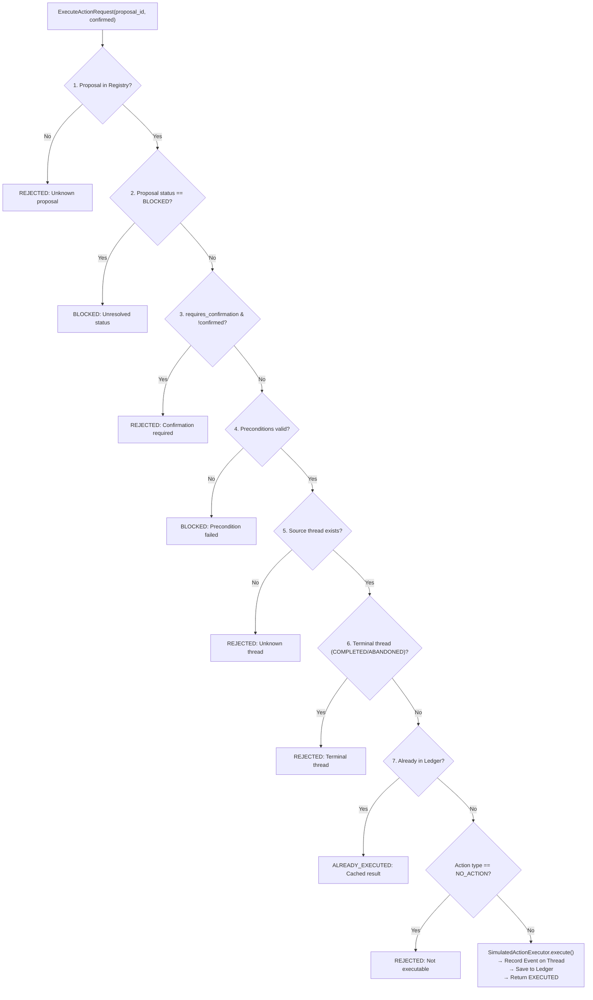

# Threadback — Controlled Action Execution (M7)

> **M7 performs controlled simulated execution only. No external side effect occurs.**

---

## 1. M7 Purpose

Milestone M7 introduces Threadback's first **controlled execution layer**.

The complete architectural pipeline becomes:

```text
IntentThread
     ↓
M4 AnalysisService.analyze()
     ↓
ThreadAnalysis
     ↓
M5 NextActionService.suggest_action()
     ↓
NextActionSuggestion
     ↓
M6 ActionPreparationService.prepare_action()
     ↓
ActionProposal (registered with ProposalRegistry)
     ↓
M7 ExecutionService.execute_action()
     ↓
SimulatedActionExecutor
     ↓
ExecutionResult + Thread Audit Event
```

M6 answered:
> “What exactly would Threadback do if you asked it to proceed?”

M7 answers:
> **“Given this exact, validated, and confirmed ActionProposal, safely simulate its execution and record an auditable trail.”**

M7 bridges preparation and execution while maintaining strict, inviolable safety boundaries.

---

## 2. Core Safety Principle & Execution Boundary

Threadback may execute only an **explicitly prepared proposal** whose identity, confirmation state, preconditions, and source thread all validate.

The execution layer **never**:
- invents or fabricates a proposal;
- silently modifies a proposal;
- executes a different action than the prepared proposal;
- treats `CONFIRMATION_REQUIRED` as confirmation;
- infers user confirmation from natural language, intent, conversation history, or tool invocation;
- contacts external services or APIs;
- sends real messages, emails, SMS, or WhatsApp communications;
- makes phone calls;
- books appointments on external calendars;
- submits forms or makes payments;
- invokes browser automation or external webhooks;
- claims that an external action actually happened.

---

## 3. Proposal Registry

M7 introduces an **in-memory, ephemeral Proposal Registry** (`ProposalRegistry`).

### Responsibilities
1. **Preservation**: Stores the exact `ActionProposal` object produced during `prepare_action`.
2. **Authority**: The proposal's deterministic `id` (`proposal-<16-hex-digest>`) serves as the authoritative key.
3. **Immutability**: Prevents execution against newly reconstructed or client-tampered proposals.
4. **Referential Integrity**: `execute_action` references the proposal strictly by ID.

### Ephemeral Limitation
The registry is intentionally in-memory only. Restarting or terminating the backend process clears the registry. This ensures that no stale or unreviewed proposals persist across server sessions without a persistent database layer.

---

## 4. Explicit Confirmation Semantics

Threadback strictly separates **preparation** from **confirmation**:

```text
requires_confirmation == True ∧ confirmed == False  →  REJECTED
requires_confirmation == True ∧ confirmed == True   →  EXECUTED (Simulated)
requires_confirmation == False                      →  EXECUTED (Simulated)
```

### Critical Rules
- **No inferred confirmation**: Neither the prompt context, conversation tone, nor the tool call itself is accepted as confirmation.
- **Explicit parameter**: Only `confirmed=true` in the `execute_action` call satisfies confirmation.
- If a proposal requires confirmation and `confirmed=false` (or omitted), execution is **REJECTED** with a clear explanation specifying the `confirmation_reason`.

---

## 5. Execution Validation Pipeline

Every execution request passes through a strict 7-step validation pipeline in exact order:



### Step Breakdown
1. **Step 1 — Proposal Existence**: Looks up `proposal_id` in `ProposalRegistry`. If missing, returns `REJECTED`. Never auto-reconstructs.
2. **Step 2 — Proposal Status**: If `status == BLOCKED`, returns `BLOCKED`. A blocked proposal is never executed.
3. **Step 3 — Explicit Confirmation**: If `requires_confirmation == True`, requires `confirmed == True`. Otherwise returns `REJECTED`.
4. **Step 4 — Preconditions**: Validates every precondition against current thread commitments and dependencies. If any fail, returns `BLOCKED`.
5. **Step 5 — Source Thread Existence**: Verifies `proposal.thread_id` corresponds to a known thread in `ThreadService`. If not found, returns `REJECTED`.
6. **Step 6 — Terminal Thread Protection**: If the thread is `COMPLETED` or `ABANDONED`, returns `REJECTED`.
7. **Step 7 — Idempotency Check**: If `proposal_id` was already executed, returns `ALREADY_EXECUTED` with previous execution metadata without creating a duplicate event.
8. **Action Type Check**: If `action_type == NO_ACTION`, returns `REJECTED`.

---

## 6. Execution Taxonomy & Semantics (M7 / M13)

Threadback distinguishes between two fundamentally different types of actions:

### A. External-World Operational Actions (`SIMULATED`)
Operations intended to interact with or affect the outside world (e.g. sending emails, making phone calls, booking appointments, submitting applications).
- **Execution Mode:** Strictly `SIMULATED` (`ExecutionMode.SIMULATED`).
- **Safety Invariant:** Never performs real-world side effects, network calls, or third-party mutations.
- **Completion Invariant:** `EXECUTION_SUCCESS != VERIFIED_COMPLETION`. Simulated execution creates an internal audit record on the thread but does NOT mark the intention complete.

| Action Category | Outcome Message |
|---|---|
| `DIRECT_NEXT_ACTION` | `"The direct next action was simulated successfully."` |
| `UNBLOCKER_ACTION` | `"The unblocker action was simulated successfully."` |
| `FOLLOW_UP_ACTION` | `"The follow-up action was simulated successfully."` |
| `GATHER_EVIDENCE_ACTION` | `"The evidence-gathering action was simulated successfully."` |
| `NO_ACTION` | *Not executable — returns REJECTED.* |

The system **never** describes simulated external actions as real-world delivery:
- ✅ *Correct:* `"The follow-up action was simulated successfully."`
- ❌ *Incorrect:* `"The email was sent to Acme Corp."`

### B. Threadback Internal State Mutations (`PERSISTENT_MUTATION`)
Operations that intentionally evolve or transition Threadback's internal memory and lifecycle state:
- `EVOLVE_INTENTION`: Updates `current_goal` while preserving immutable `original_goal` and appends `INTENTION_EVOLVED` event.
- `DEFER_INTENTION`: Transitions thread to `DEFERRED` status, sets `deferred_until`, and appends `THREAD_DEFERRED` event.
- `RESUME_INTENTION`: Transitions thread back to `ACTIVE` status and appends `THREAD_RESUMED` event.
- `ABANDON_INTENTION`: Explicitly terminates thread to `ABANDONED` status with `abandoned_reason` and appends `THREAD_ABANDONED` event.
- **Execution Mode:** `PERSISTENT_MUTATION` (`ExecutionMode.PERSISTENT_MUTATION`).
- **Safety Invariant:** `Persistent Threadback mutation != external-world action`. They intentionally modify durable SQLite storage and append lifecycle/audit events following the standard proposal/confirmation safety gate. They must never be described as simulated external actions.

---

## 7. Execution Result Model

`ExecutionResult` is strongly typed:

```python
class ExecutionResult(BaseModel):
    proposal_id: str
    thread_id: str
    action_type: NextActionType
    execution_status: ExecutionStatus  # EXECUTED, REJECTED, BLOCKED, ALREADY_EXECUTED
    execution_mode: ExecutionMode      # SIMULATED or PERSISTENT_MUTATION
    message: str
    event_id: str | None = None
```

### Execution Statuses
- `EXECUTED`: Action executed successfully (in `SIMULATED` mode for operational actions, or `PERSISTENT_MUTATION` mode for internal state mutations).
- `REJECTED`: Request failed safety validation (unconfirmed, unknown proposal, terminal thread, NO_ACTION, unsupported mode).
- `BLOCKED`: Request blocked due to failed domain preconditions or blocked proposal status.
- `ALREADY_EXECUTED`: Proposal previously executed; returned from ledger / persistent event history (idempotent).

---

## 8. Event Recording & Auditing

Upon successful simulation, `SimulatedActionExecutor` constructs an auditable `Event` appended to `thread.events`:

```json
{
  "id": "evt-exec-d8e12f6a9c40b3e7",
  "type": "SIMULATED_EXECUTION",
  "description": "Action executed in simulated mode. proposal_id: proposal-d8e12f6a9c40b3e7, action_type: UNBLOCKER_ACTION, execution_mode: SIMULATED",
  "timestamp": "2026-09-28T15:00:00Z"
}
```

This guarantees complete traceability: `proposal -> execution -> thread`.

---

## 9. Why Simulated Execution Does Not Equal Thread Completion

M7 is intentionally conservative:
- Simulating an action **does not automatically mark commitments completed**.
- Simulating an action **does not automatically transition a thread to COMPLETED**.
- Real-world fulfillment requires actual external feedback, evidence capture, and human verification.

---

## 10. Idempotency

Threadback maintains an in-memory execution ledger mapping `proposal_id -> ExecutionResult`.
- Calling `execute_action` on an already-executed proposal returns `ALREADY_EXECUTED`.
- The previous `event_id` and execution information are preserved.
- Zero duplicate events are added to the thread.

---

## 11. MCP Tool: `execute_action`

Tool 7 of exactly 7 exposed tools on the Streamable HTTP server at `/mcp`.

### Input Schema
```json
{
  "proposal_id": "proposal-d8e12f6a9c40b3e7",
  "confirmed": true,
  "execution_mode": "SIMULATED"
}
```

### Output Schema
```json
{
  "proposal_id": "proposal-d8e12f6a9c40b3e7",
  "thread_id": "thread-university-application",
  "action_type": "UNBLOCKER_ACTION",
  "execution_status": "EXECUTED",
  "execution_mode": "SIMULATED",
  "message": "The unblocker action was simulated successfully.",
  "event_id": "evt-exec-d8e12f6a9c40b3e7",
  "result": {
    "proposal_id": "proposal-d8e12f6a9c40b3e7",
    "thread_id": "thread-university-application",
    "action_type": "UNBLOCKER_ACTION",
    "execution_status": "EXECUTED",
    "execution_mode": "SIMULATED",
    "message": "The unblocker action was simulated successfully.",
    "event_id": "evt-exec-d8e12f6a9c40b3e7"
  }
}
```

---

## 12. Future Integration Boundary (M8)

| Capability | Milestone M7 | Milestone M8+ |
|---|---|---|
| Execution Mode | `SIMULATED` only | External adapters (email, calendar, webhooks) |
| Side Effects | None (in-memory only) | Real-world external side effects |
| Proposal Storage | In-memory `ProposalRegistry` | Persistent database storage |
| Confirmation | Explicit parameter (`confirmed=true`) | Human-in-the-loop multi-channel confirmation |
| External APIs | Strictly forbidden | Governed execution connectors |
