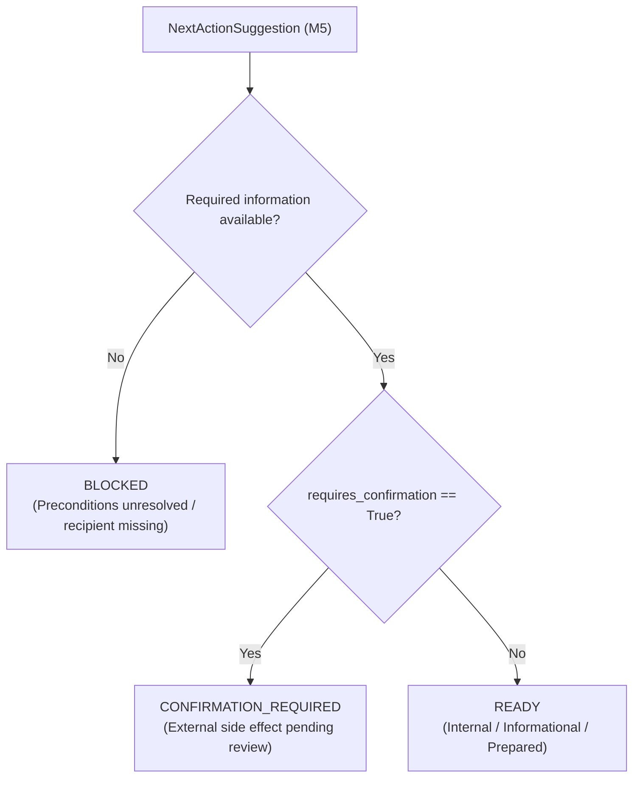

# Threadback — Action Preparation & Confirmation (M6)

## Overview

The **Action Preparation & Confirmation layer** forms the critical safety bridge between deterministic next-action recommendations (M5) and future action execution:

```text
M4 → Understand
M5 → Recommend
M6 → Prepare + Ask for Confirmation
M7 → Execute
```

M5 answers:
> “What should I do next?”

M6 answers:
> **“What exactly would Threadback do if you asked it to proceed?”**

M6 converts a deterministic `NextActionSuggestion` into an explicit, transparent, human-reviewable `ActionProposal`.

---

> [!IMPORTANT]
> ### Critical Non-Execution Safety Boundary
> **M6 is strictly a pre-execution milestone.**
>
> The system **never executes actions**. Specifically, Threadback does NOT:
> - send emails, SMS, or Slack/chat messages;
> - place phone calls or voice interactions;
> - schedule or book calendar appointments;
> - submit forms or web applications;
> - initiate payments or bank transfers;
> - modify external systems, databases, or accounts;
> - trigger browser automation or third-party webhooks.
>
> Calling `prepare_action` produces an **in-memory planning proposal only**.

---

## 1. Architecture & Pipeline

```text
IntentThread
     ↓
AnalysisService.analyze() [M4]
     ↓
ThreadAnalysis
     ↓
NextActionService.suggest_action() [M5]
     ↓
NextActionSuggestion
     ↓
ActionPreparationService.prepare_action() [M6]
     ↓
ActionProposal
     ↓
MCP Tool: prepare_action
```

### Layer Separation
- **MCP Adapter** (`app/mcp/server.py`): Handles protocol request deserialization, routing, and structured error responses.
- **Service Layer** (`app/services/action_preparation_service.py`): Consumes `IntentThread` and `NextActionSuggestion` to derive structured proposals without rediscovering actions independently.
- **Domain Layer** (`app/domain/models.py`, `app/domain/enums.py`): Strongly-typed, immutable Pydantic models for proposals, statuses, and risk classifications.

---

## 2. ActionProposal Domain Model

The `ActionProposal` model provides complete transparency into the prepared action:

| Field | Type | Description |
|---|---|---|
| `id` | `str` | Deterministic proposal identity (`proposal-<hash>`) derived from stable domain inputs. |
| `thread_id` | `str` | Stable identifier of the analyzed intent thread. |
| `action_type` | `NextActionType` | Category inherited directly from the M5 recommendation. |
| `title` | `str` | Concise, user-facing summary of the prepared step. |
| `description` | `str` | Detailed narrative of what preparation was performed. |
| `rationale` | `str` | Structured explanation grounding the proposal in thread data. |
| `status` | `ProposalStatus` | `READY`, `CONFIRMATION_REQUIRED`, or `BLOCKED`. |
| `requires_confirmation` | `bool` | True if the action would produce external side effects. |
| `confirmation_reason` | `str \| None` | Plain-English explanation of why confirmation is required or why preparation is blocked. |
| `inputs` | `dict[str, Any]` | Extracted parameters (e.g. recipient, task) required to perform the action. **Never fabricated.** |
| `preconditions` | `list[str]` | Conditions that must be satisfied before execution. |
| `supporting_evidence_ids` | `list[str]` | Traceable IDs of evidentiary records grounding this action. |
| `supporting_commitment_ids`| `list[str]` | Traceable IDs of open commitments addressed by this action. |
| `supporting_dependency_ids`| `list[str]` | Traceable IDs of dependencies addressed or awaited. |
| `risk_level` | `RiskLevel` | `LOW`, `MEDIUM`, or `HIGH`. |
| `created_at` | `datetime` | Deterministic timestamp anchor (`DEFAULT_ANALYSIS_REFERENCE_TIME`). |

### Proposal Identity & Deterministic Derivation

Each `ActionProposal` contains a stable, unique `id` representing the prepared proposal itself (distinct from the underlying `thread_id`).

- **Deterministic guarantee**: Proposal IDs are never derived from random UUIDs, wall-clock timestamps, `uuid4()`, or process memory pointers. Repeated calls with identical domain state always yield identical proposal IDs.
- **Stable derivation inputs**:
  1. `thread_id` (e.g. `thread-university-application`)
  2. `action_type` value (e.g. `UNBLOCKER_ACTION`)
  3. Sorted `supporting_evidence_ids` (e.g. `["evi-uni-1"]`)
  4. Sorted `supporting_commitment_ids` (e.g. `["com-uni-submit"]`)
  5. Sorted `supporting_dependency_ids` (e.g. `["dep-uni-rec-letter"]`)
- **Derivation scheme**:
  ```python
  raw_material = f"{thread_id}:{action_type}:{','.join(sorted(evidence_ids))}:{','.join(sorted(commitment_ids))}:{','.join(sorted(dependency_ids))}"
  digest = sha256(raw_material.encode("utf-8")).hexdigest()[:16]
  id = f"proposal-{digest}"
  ```
- **Role for Future Execution (M7)**: The deterministic `id` provides a stable, immutable reference that a future execution layer can reference to verify confirmation without re-evaluating or guessing proposal identity.

---

## 3. Proposal Statuses



### `READY`
The action is fully prepared and requires no additional external confirmation step.
*Does not imply the action was executed.*
- Used for internal planning, evidence-gathering checklists, local implementation tasks, or closed threads.

### `CONFIRMATION_REQUIRED`
The action would eventually create an external side effect (e.g. sending a message or client follow-up).
- Explicit human approval is mandatory before any future execution engine may proceed.

### `BLOCKED`
The action cannot currently be prepared safely because essential information or an indispensable prerequisite is unresolved.
- Threadback **never invents missing facts**. If a recipient or parameter is missing from the structured data, the proposal is marked `BLOCKED`.

---

## 4. Confirmation Invariant

The engine guarantees strict internal consistency:

$$\text{requires\_confirmation} = \text{True} \implies \text{status} \in \{\text{CONFIRMATION\_REQUIRED}, \text{BLOCKED}\}$$

An action requiring confirmation can **never** be marked `READY`.

---

## 5. Deterministic Risk Classification

Risk levels are derived deterministically based on action category and side-effect impact:

| Risk Level | Definition | Scenarios | Examples |
|---|---|---|---|
| **`LOW`** | Internal, reversible, informational | `GATHER_EVIDENCE_ACTION`, `NO_ACTION`, internal implementation `DIRECT_NEXT_ACTION` | Review evidence, draft checklist, internal coding task |
| **`MEDIUM`** | External communication or reversible external change | `UNBLOCKER_ACTION` or `FOLLOW_UP_ACTION` involving external parties | Email draft to Ahmed, follow-up inquiry to client |
| **`HIGH`** | Consequential, financial, or irreversible change | Payment, refund, account cancellation, irreversible submission | Tuition payment, service cancellation, final binding submission |

---

## 6. Action Category Mapping

### A. `DIRECT_NEXT_ACTION`
- **Focus**: Concrete open commitment or thread-level milestone.
- **Inputs**: Extracted commitment ID, task description, and thread ID.
- **Risk**: Typically `LOW` (unless commitment description references payment/cancellation).
- **Status**: `READY` (or `CONFIRMATION_REQUIRED` if external side effects exist).

### B. `UNBLOCKER_ACTION`
- **Focus**: Addressing active blocking dependencies.
- **Inputs**: Identified recipient party, blocker ID, and blocker description.
- **Risk**: `MEDIUM`.
- **Status**: `CONFIRMATION_REQUIRED` (or `BLOCKED` if recipient is unknown).

### C. `FOLLOW_UP_ACTION`
- **Focus**: Inquiring on pending dependencies while waiting.
- **Inputs**: Identified recipient party, dependency subject, and thread ID.
- **Risk**: `MEDIUM`.
- **Status**: `CONFIRMATION_REQUIRED` (or `BLOCKED` if recipient is unknown).

### D. `GATHER_EVIDENCE_ACTION`
- **Focus**: Planning missing context collection when evidence is insufficient.
- **Inputs**: Thread title and thread ID.
- **Risk**: `LOW`.
- **Status**: `READY` (`requires_confirmation = False`).

### E. `NO_ACTION`
- **Focus**: Completed, abandoned, or dismissed threads.
- **Inputs**: Empty (`{}`).
- **Risk**: `LOW`.
- **Status**: `READY` (`requires_confirmation = False`, non-executable).

---

## 7. Missing Information Behavior

When preparing an action that requires external outreach (such as an email or follow-up), Threadback scans structured dependency metadata and supporting evidence for the recipient party.

If no recipient is identified in the existing Threadback data:
1. The engine **does not guess, hallucinate, or fabricate** an identity.
2. The proposal status is set to **`BLOCKED`**.
3. A descriptive `confirmation_reason` explains:
   > *“The follow-up cannot be prepared because the required recipient is not identified in the available Threadback data.”*
4. A prerequisite is appended to `preconditions`:
   > *“Recipient identity must be established before preparation”*.

---

## 8. MCP Tool Specification

Exposed at the canonical Streamable HTTP endpoint:
```text
POST http://localhost:8000/mcp
```

### Signature: `prepare_action`
- **Description**: Prepare a structured, reviewable action proposal for an IntentThread. Planning only — does NOT execute actions.
- **Input**:
  ```json
  {
    "thread_id": "thread-university-application"
  }
  ```
- **Output Schema**:
  ```json
  {
    "proposal": {
      "id": "proposal-d8e12f6a9c40b3e7",
      "thread_id": "thread-university-application",
      "action_type": "UNBLOCKER_ACTION",
      "title": "Resolve blocker: Recommendation letter from Ahmed",
      "description": "Prepare a request or outreach to resolve blocking dependency 'Recommendation letter from Ahmed'.",
      "rationale": "Progress on 'University Application' is blocked by pending dependency 'Recommendation letter from Ahmed'. Addressing this blocker is required before the thread can proceed.",
      "status": "CONFIRMATION_REQUIRED",
      "requires_confirmation": true,
      "confirmation_reason": "External communication with Ahmed (PERSON) requires explicit user confirmation before sending.",
      "inputs": {
        "thread_id": "thread-university-application",
        "recipient": "Ahmed",
        "blocker_id": "dep-uni-rec-letter",
        "blocker_description": "Recommendation letter from Ahmed"
      },
      "preconditions": [
        "Dependency 'Recommendation letter from Ahmed' must be resolved"
      ],
      "supporting_evidence_ids": [
        "evi-uni-1"
      ],
      "supporting_commitment_ids": [
        "com-uni-submit"
      ],
      "supporting_dependency_ids": [
        "dep-uni-rec-letter"
      ],
      "risk_level": "MEDIUM",
      "created_at": "2026-09-28T15:00:00Z"
    }
  }
  ```

---

## 9. Demo Walkthroughs

### Scenario 1: University Application (Active Blocker)
- **Status**: `CONFIRMATION_REQUIRED`
- **Action Type**: `UNBLOCKER_ACTION`
- **Risk Level**: `MEDIUM`
- **Recipient**: `"Ahmed"`
- **Traceability**: Grounds to `dep-uni-rec-letter`, `com-uni-submit`, and `evi-uni-1`.

### Scenario 2: Client Report (Waiting on Client)
- **Status**: `CONFIRMATION_REQUIRED`
- **Action Type**: `FOLLOW_UP_ACTION`
- **Risk Level**: `MEDIUM`
- **Recipient**: `"Acme Corp"`
- **Traceability**: Grounds to `dep-client-response` and `evi-client-1`.

### Scenario 3: AWS Hackathon (Actionable Direct Next Step)
- **Status**: `READY`
- **Action Type**: `DIRECT_NEXT_ACTION`
- **Risk Level**: `LOW`
- **Task**: `"Complete M3 domain layer and MCP tools implementation"`
- **Traceability**: Grounds to `com-aws-m3`, `evi-aws-1`, and `evi-aws-2`.

### Scenario 4: Dentist Appointment (Insufficient Evidence)
- **Status**: `READY`
- **Action Type**: `GATHER_EVIDENCE_ACTION`
- **Risk Level**: `LOW`
- **Task**: Evidence-gathering plan to collect missing clinic notes.
- **Traceability**: Grounds to `evi-dentist-1`.

### Scenario 5: Tax Filing 2025 (Completed)
- **Status**: `READY`
- **Action Type**: `NO_ACTION`
- **Risk Level**: `LOW`
- **Traceability**: No open commitments or blockers.

---

## 10. Deterministic Guarantees & Non-Execution Boundary

1. **Purely In-Memory**: No database tables or file persistence introduced.
2. **Zero Execution**: No HTTP requests to external APIs, no emails sent, no browser actions dispatched.
3. **Reproducibility**: Calling `prepare_action` repeatedly on identical data produces identical outputs.
4. **Reference-Time Anchoring**: Uses `DEFAULT_ANALYSIS_REFERENCE_TIME` for `created_at` timestamps to avoid wall-clock nondeterminism.
